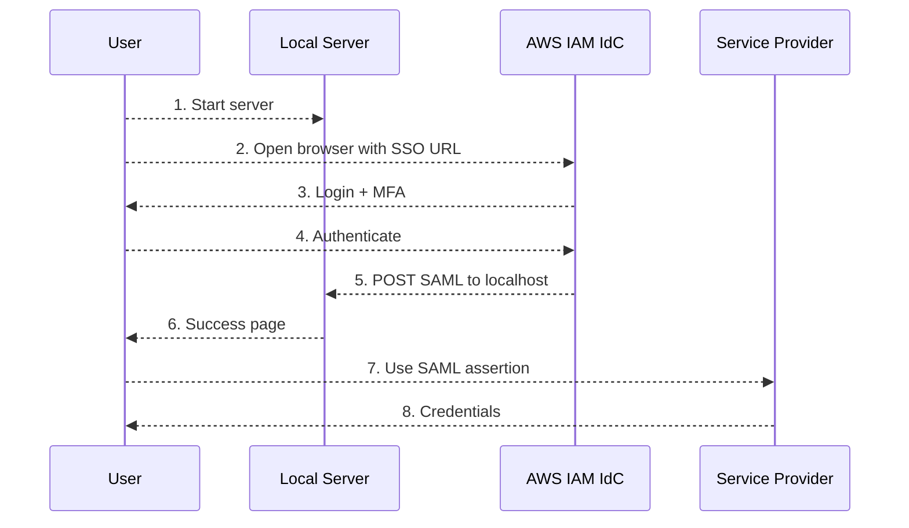

# aws-idc-saml-capture


## Description

Local HTTP server that captures SAML assertions from **AWS IAM Identity Center** (formerly AWS SSO) **customer managed SAML 2.0 applications** for programmatic use with any SAML Service Provider.

## Why?

AWS IAM Identity Center (IdC) handles browser-based SAML SSO seamlessly — you click a customer managed SAML application tile, authenticate, and the SAML assertion is POSTed directly to the Service Provider's ACS URL. This works great for console/web access.

The problem arises when you need the raw SAML assertion for CLI or API use (e.g. `AssumeRoleWithSAML` for Alibaba Cloud or AWS IAM, or any SP that accepts SAML assertions programmatically). IAM Identity Center doesn't expose SAML assertions through an API or CLI — the only delivery mechanism is the browser-based POST to the ACS endpoint. There's no `aws sso get-saml-assertion` equivalent.

One approach is to automate the browser with tools like Selenium or Playwright to intercept the SAML POST mid-flight. While this works, it comes with significant downsides: heavy dependencies (headless browser + driver), fragile selectors that break when AWS changes the login UI, difficulty handling MFA prompts, and complex session/cookie management. It's a lot of moving parts for what should be a simple capture.

This tool takes a lighter approach — instead of fighting the browser, it works *with* it. It starts a lightweight server on `localhost`, receives the SAML POST that would normally go to the SP, and makes the assertion available for programmatic use — letting you feed it into CLI tools, SDKs, or custom scripts. No browser automation, no extra dependencies, just Python stdlib.

Note that this means you'll typically need two separate IdC SAML applications per SP: one for browser-based access (ACS URL pointing to the SP) and one for CLI/programmatic use (ACS URL pointing to `http://localhost:<port>/saml/acs`). The attribute mappings are the same for both. Since each IdC application has unique metadata (different Issuer/entityID), you'll also need a separate SAML Identity Provider on the SP side for each application.

> **Note:** Because the ACS URL is set to `localhost`, the SAML response's `Recipient` field will also be `http://localhost:<port>/saml/acs`. Some Service Providers check this value during authorization (e.g. AWS IAM uses it as the `SAML:aud` condition key in role trust policies). You may need to adjust your SP's configuration to accept the localhost URL alongside the original ACS URL. See [Troubleshooting — Recipient mismatch](#recipient-mismatch) for details.

## How It Works



The server listens on `localhost:8443` (configurable via `--port`, but must match the port in your IAM Identity Center application's ACS URL), receives the SAML POST callback from AWS IAM Identity Center after you authenticate, extracts the assertion and attributes, and optionally saves them to a JSON file. You then use the captured assertion to authenticate with your target Service Provider (Alibaba Cloud, custom apps, etc.). The server always binds to `localhost` and cannot be changed — this is intentional to prevent accidental network exposure.

## Requirements

- Python >= 3.12
- [uv](https://docs.astral.sh/uv/) (optional, recommended)

## Usage

The `--sso-url` is the direct link to your SAML application in the AWS IAM Identity Center portal. You can obtain it by right-clicking the application tile in your SSO portal and copying the link address (see [Get the SSO URL](#get-the-sso-url)).

Alternatively, you can pass the IAM Identity Center access portal URL (`https://<directory-id>.awsapps.com/start`) — the browser will open the portal and you'll need to manually click the application tile to trigger the SAML flow.

### With uv (recommended)

```bash
uv run saml_server.py \
  --sso-url "https://<directory-id>.awsapps.com/start/#/saml/default/<app-name>/<instance-id>"
```

### With python

```bash
python saml_server.py \
  --sso-url "https://<directory-id>.awsapps.com/start/#/saml/default/<app-name>/<instance-id>"
```

### Save to File

```bash
python saml_server.py --sso-url "https://..." -o saml.json
```

### Other Options

```bash
python saml_server.py --sso-url "https://..." \
  --port 9000          # custom port (default: 8443)
  --no-browser         # don't auto-open browser
  --print-saml         # print decoded SAML XML to stdout
  --timeout 120        # seconds to wait (default: 300)
  --quiet              # suppress info output
  --verbose            # debug-level output
```

### Output (saml.json)

```json
{
  "saml_response": "PHNhbWxwOlJlc3BvbnNlIC...base64...",
  "decoded_xml": "<samlp:Response ...>...</samlp:Response>",
  "assertion": "PHNhbWw6QXNzZXJ0aW9uIC...base64...",
  "relay_state": null,
  "attributes": {
    "Role": ["arn:aws:iam::123456:role/MyRole,arn:aws:iam::123456:saml-provider/MyIdP"],
    "RoleSessionName": ["[email]"],
    "SessionDuration": ["3600"]
  }
}
```

## AWS IAM Identity Center Setup

This is the **IdP side** — the same regardless of which Service Provider you're federating with.

### Create Custom SAML Application

See [Add and configure a customer managed application](https://docs.aws.amazon.com/singlesignon/latest/userguide/customermanagedapps-saml2-setup.html) in the AWS IAM Identity Center documentation.

### Get the SSO URL

1. Go to your SSO Portal: `https://<directory-id>.awsapps.com/start`
2. Right-click on the application → **Copy link address**
3. Format: `https://<directory-id>.awsapps.com/start/#/saml/default/<app-name>/<instance-id>`

---

## Service Provider Examples

### AWS IAM (Cross-Account / Standalone)

<details>
<summary>Setup and usage</summary>

Useful when you need to assume a role in a standalone AWS account, a different organization, or any account that doesn't use IAM Identity Center directly — by federating through a SAML IdP.

#### Target AWS Account Configuration

1. Go to **IAM** → **Identity providers** → **Add provider**
2. Select **SAML**, give it a name (e.g. `idc-saml-provider`)
3. Upload the IAM Identity Center metadata XML (downloaded when creating the IdC application)
4. Go to **IAM** → **Roles** → **Create role**
5. Select **SAML 2.0 federation** as the trusted entity
6. Choose the IdP you just created
7. Select **Allow programmatic access only** (should be sufficient)
8. For the condition, select **Attribute**: `SAML:aud`, Value: `http://localhost:8443/saml/acs` (optionally also add `https://signin.aws.amazon.com/saml` if you plan to use the role for browser access too)
9. Attach the desired policies and create the IAM role
10. Note the Role ARN (`arn:aws:iam::<account-id>:role/<role-name>`) and Provider ARN (`arn:aws:iam::<account-id>:saml-provider/<provider-name>`)

After creating the IAM role, verify the trust policy includes the **local ACS URL as a valid audience**. If you added both values during role creation, it should already look like this:

```json
{
  "Version": "2012-10-17",
  "Statement": [
    {
      "Effect": "Allow",
      "Principal": {
        "Federated": "arn:aws:iam::<account-id>:saml-provider/<provider-name>"
      },
      "Action": "sts:AssumeRoleWithSAML",
      "Condition": {
        "StringEquals": {
          "SAML:aud": [
            "https://signin.aws.amazon.com/saml",
            "http://localhost:8443/saml/acs"
          ]
        }
      }
    }
  ]
}
```

> The first value is for browser-based console access; the second is for this tool. If you only use the CLI, the localhost entry alone is sufficient.

> If you use a custom port (`--port`), adjust the localhost URL in the trust policy accordingly.

#### AWS IAM IdC Application Settings

| Field | Value |
|-------|-------|
| Display name | `AWS Cross-Account CLI` |
| Application ACS URL | `http://localhost:8443/saml/acs` |
| Application SAML audience | `https://signin.aws.amazon.com/saml` |

#### Attribute Mappings

| Attribute in application | Maps to | Format |
|--------------------------|---------|--------|
| `https://aws.amazon.com/SAML/Attributes/Role` | `arn:aws:iam::<account-id>:role/<role-name>,arn:aws:iam::<account-id>:saml-provider/<provider-name>` | unspecified |
| `https://aws.amazon.com/SAML/Attributes/RoleSessionName` | `${user:email}` | unspecified |
| `https://aws.amazon.com/SAML/Attributes/SessionDuration` | `3600` *(optional, seconds)* | unspecified |

Refer to [Configuring SAML assertions for the authentication response](https://docs.aws.amazon.com/IAM/latest/UserGuide/id_roles_providers_create_saml_assertions.html) for the full list of supported attributes.

#### Use the Captured Assertion

```bash
aws sts assume-role-with-saml \
  --role-arn "arn:aws:iam::<account-id>:role/<role-name>" \
  --principal-arn "arn:aws:iam::<account-id>:saml-provider/<provider-name>" \
  --saml-assertion "$(jq -r '.saml_response' saml.json)"
```

#### Browser Access (Optional)

For direct AWS Console access, create a second AWS IdC application with ACS URL `https://signin.aws.amazon.com/saml` (same attribute mappings). Since each IdC application has unique metadata (different Issuer/entityID), you'll also need a separate IAM SAML Identity Provider for the browser application.

</details>

### Alibaba Cloud RAM

<details>
<summary>Setup and usage</summary>

#### Alibaba Cloud Configuration

1. Go to **RAM Console** → **SSO** → **Role-based SSO**
2. **Create IdP** — upload AWS IAM Identity Center metadata XML
3. **Create RAM Role** — select the SAML IdP as trusted entity. When configuring the trust policy, update the `saml:recipient` condition to allow both the Alibaba Cloud ACS URL and the local capture endpoint:

```json
{
  "Version": "1",
  "Statement": [
    {
      "Effect": "Allow",
      "Principal": {
        "Federated": "acs:ram::<account-id>:saml-provider/<idp-name>"
      },
      "Action": "sts:AssumeRole",
      "Condition": {
        "StringEquals": {
          "saml:recipient": [
            "https://signin.alibabacloud.com/saml-role/sso",
            "http://localhost:8443/saml/acs"
          ]
        }
      }
    }
  ]
}
```

> The first value is for browser-based console access; the second is for this tool. If you only use the CLI, the localhost entry alone is sufficient.

4. Note the Role ARN (`acs:ram::<account-id>:role/<role-name>`)

#### AWS IAM IdC Application Settings

| Field | Value |
|-------|-------|
| Display name | `Alibaba Cloud CLI` |
| Application ACS URL | `http://localhost:8443/saml/acs` |
| Application SAML audience | `urn:alibaba:cloudcomputing:international` |

> The SAML audience differs by region: `urn:alibaba:cloudcomputing:international` for the international site and `urn:alibaba:cloudcomputing` for the China site. See [Configure Alibaba Cloud as a trusted SP for role-based SSO](https://www.alibabacloud.com/help/en/ram/configure-alibaba-cloud-as-a-trusted-sp-for-role-based-sso) for details.

#### Attribute Mappings

Refer to [SAML response for role-based SSO](https://www.alibabacloud.com/help/en/ram/saml-response-for-role-based-sso) for the full list of required attributes.

| Attribute in application | Maps to | Format |
|--------------------------|---------|--------|
| `https://www.aliyun.com/SAML-Role/Attributes/Role` | `acs:ram::<alibaba-account-id>:role/<role-name>,acs:ram::<alibaba-account-id>:saml-provider/<idp-name>` | unspecified |
| `https://www.aliyun.com/SAML-Role/Attributes/RoleSessionName` | `${user:email}` | unspecified |
| `https://www.aliyun.com/SAML-Role/Attributes/SessionDuration` | `3600` *(optional, seconds)* | unspecified |

#### Use the Captured Assertion

```bash
aliyun sts AssumeRoleWithSAML \
  --RoleArn "acs:ram::123456:role/test-role" \
  --SAMLProviderArn "acs:ram::123456:saml-provider/test-provider" \
  --SAMLAssertion "$(jq -r '.saml_response' saml.json)" \
  --region <region-id>
```

#### Browser Access (Optional)

For direct Alibaba Console access, create a second AWS IdC application with ACS URL `https://signin.alibabacloud.com/saml-role/sso` (same attribute mappings). Since each IdC application has unique metadata (different Issuer/entityID), you'll also need a separate SAML IdP in the Alibaba RAM console for the browser application.

</details>

### Generic / Custom SP

<details>
<summary>Setup and usage</summary>

The server captures any standard SAML 2.0 POST binding response. To use it with any SP:

1. Create a custom SAML 2.0 application in AWS IAM Identity Center
2. Set ACS URL to `http://localhost:8443/saml/acs`
3. Set the SAML audience to whatever your SP expects
4. Configure attribute mappings per your SP's requirements
5. If your SP validates the SAML `Recipient` field (e.g. via `SAML:aud` in AWS or `saml:recipient` in Alibaba Cloud), add `http://localhost:8443/saml/acs` as an allowed value in the SP's trust policy
6. Run the server, authenticate, and use the captured `saml_response` (base64-encoded) with your SP's API or CLI

</details>

## Security Considerations

| Aspect                 | Status                 | Notes                                                                                                        |
| ---------------------- | ---------------------- | ------------------------------------------------------------------------------------------------------------ |
| SAML signature         | Signed by AWS IdC      | SP verifies the signature; the local server does not                                                         |
| Signature verification | Not performed locally  | The server captures the assertion as-is — validation happens on the SP side when you submit it               |
| Assertion lifetime     | Short (5–15 min)       | Must be used quickly; treat `saml.json` like a short-lived credential                                        |
| Transport              | HTTP (localhost only)  | Traffic does not leave the machine; some security scanners may flag the lack of HTTPS                        |
| Host binding           | Hardcoded to localhost | Cannot be changed — prevents accidental network exposure                                                     |
| Response headers       | CSP + nosniff          | `Content-Security-Policy` and `X-Content-Type-Options` headers on all HTML responses                         |
| Port binding           | First-come-first-served| A local process could theoretically bind the port before the server starts; low risk on single-user machines |
| File storage           | Optional, mode 0600    | `saml.json` is written with owner-only permissions; delete after use                                         |
| XML parsing            | stdlib ElementTree     | Safe on Python 3.12+ (Expat ≥ 2.6.0)                                                                        |
| Browser history        | SSO URL persists       | Not a credential leak (re-authentication required), but be aware on shared machines                          |

### Localhost in SP trust policies

Adding `http://localhost:8443/saml/acs` to SP trust policy conditions (AWS IAM `SAML:aud`, Alibaba Cloud RAM `saml:recipient`) does not introduce a meaningful security risk. The SAML assertion is still cryptographically signed by IAM Identity Center — the `Recipient` value cannot be tampered with without invalidating the signature. An attacker would still need to authenticate through your IdC instance (including MFA) to obtain a valid assertion. These conditions are authorization checks on values inside the signed assertion, not network-level controls. For additional hardening, you can restrict API calls by source IP using conditions like `aws:SourceIp` (AWS) or `acs:SourceIp` (Alibaba Cloud).

### Recommendations

- Don't commit `saml.json` to version control (already in `.gitignore`)
- Delete `saml.json` promptly after use — it's a bearer credential while the assertion is valid
- Use `--no-browser` in scripts for non-interactive use
- Verify the expected port is free before starting the server
- Rotate credentials regularly

## Troubleshooting

### Server times out

Default timeout is 300 seconds. Use `--timeout` to increase it, or check that the SSO URL is correct.

### "No SAMLResponse found in POST data"

Verify the ACS URL in your AWS IdC application matches exactly: `http://localhost:<port>/saml/acs`

### Browser shows error page

1. Ensure the server is running before clicking the SSO app
2. Check that the port is not in use by another process

### SAML assertion rejected by SP

1. Verify attribute mappings in AWS IdC match your SP's requirements
2. Check that the SAML audience matches what the SP expects
3. Ensure the assertion hasn't expired (use within 5 minutes)

### Recipient mismatch

When you configure the IdC application's ACS URL as `http://localhost:<port>/saml/acs`, the IdP sets the SAML response's `Recipient` field in `SubjectConfirmationData` to the same value. Some SPs use this field in their authorization checks.

For example, AWS IAM role trust policies use the `SAML:aud` condition key, which maps to the `Recipient` field (not the `<Audience>` element). If your trust policy only allows `https://signin.aws.amazon.com/saml` but the assertion has `Recipient="http://localhost:8443/saml/acs"`, `AssumeRoleWithSAML` fails with `Not authorized to perform sts:AssumeRoleWithSAML`.

If you followed the [AWS IAM setup steps](#target-aws-account-configuration), the trust policy should already include the localhost URL. If not, add it:

```json
"SAML:aud": [
  "https://signin.aws.amazon.com/saml",
  "http://localhost:8443/saml/acs"
]
```

You can check the `Recipient` value in your captured assertion:

```bash
jq -r '.decoded_xml' saml.json | grep -oP 'Recipient="[^"]*"'
# Example output:
Recipient="http://localhost:8443/saml/acs"
```
